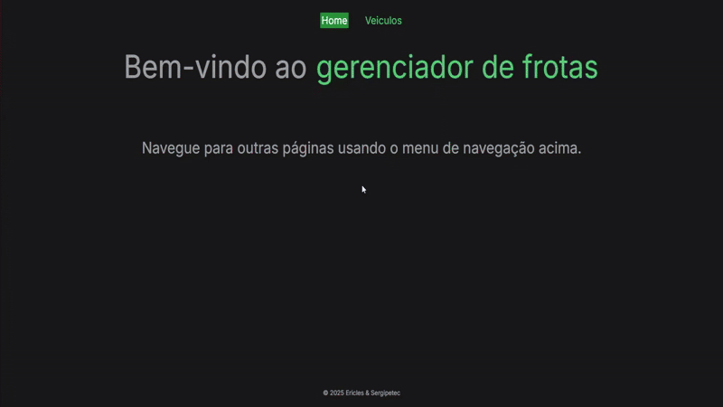
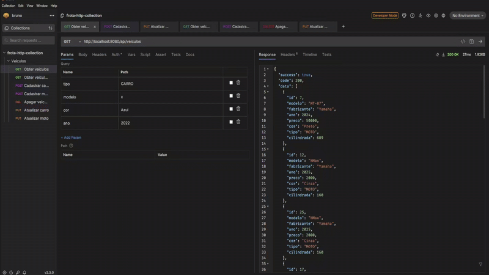
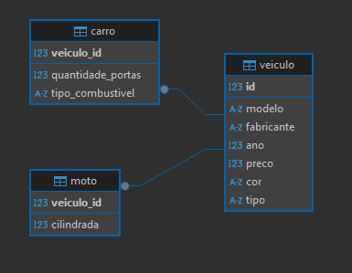

# Frota - Java + Spring Boot + Nuxt.js + Postgres + Docker

## Sobre o Projeto 🎯✨📋

Desafio proposto pela empresa Sergipetec para a vaga de Analista de sistemas.

O projeto é um sistema de frota desenvolvido com Java, Spring Boot, Nuxt.js, Postgres e Docker.

---

## Apresentação do Frontend


## Apresentação dos endpoints no Http Client Bruno 
 

## Diagrama do Banco de Dados


## Requisitos Necessários ✅🛠️📦

Antes de configurar e executar o projeto, certifique-se de ter os seguintes requisitos instalados:

 - Docker (Para execução em ambiente de desenvolvimento e produção)
 - JDK 21 (Para executar comandos Maven)
 - Maven 3.8.4 (Para execução de comandos como migrações e testes)
 - Node.js 24 (Para desenvolvimento do frontend com Nuxt.js)

---

## Instalação 🖥️🔧📂

1. Clone o repositório:

```bash 
git clone https://github.com/Ericles-Porty/sergipetec-frota
cd sergipetec-frota
```

Atualize as variáveis de ambiente conforme necessário, como credenciais de banco de dados e configurações de chave.

## Execução em Ambiente de Desenvolvimento 🚀💻🔄

1. Inicie os containers:

```bash
docker-compose up -d
```

2. Execute as migrações:

```bash
cd backend
mvn flyway:migrate
```

Backend executando em [http://localhost:8080](http://localhost:8080).


1. Inicie o frontend:

Modo de desenvolvimento:
```bash
cd frontend
yarn install
yarn run dev
```

Modo de produção:
```bash
cd frontend
yarn install
yarn run build
node .\output\server\index.mjs
```

Frontend executando em [http://localhost:3000](http://localhost:3000).

---


## Testes 🧪✅📋 (Ainda em Desenvolvimento)

Para executar os testes:
```bash
cd backend
mvn test
```

--- 
